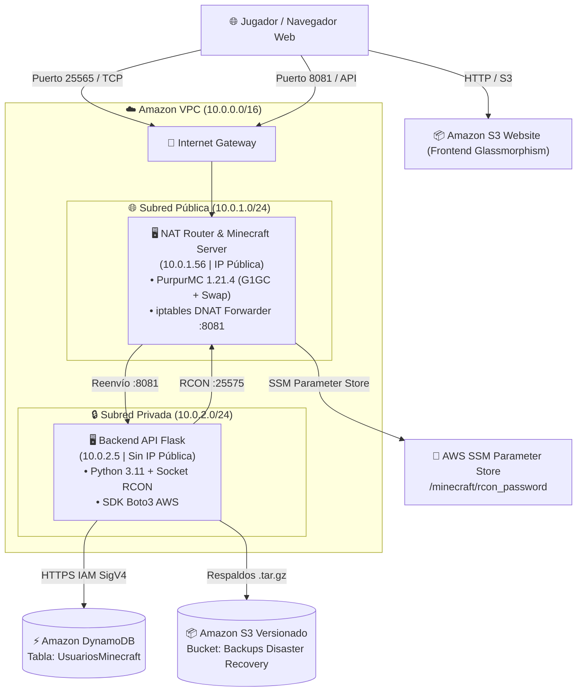
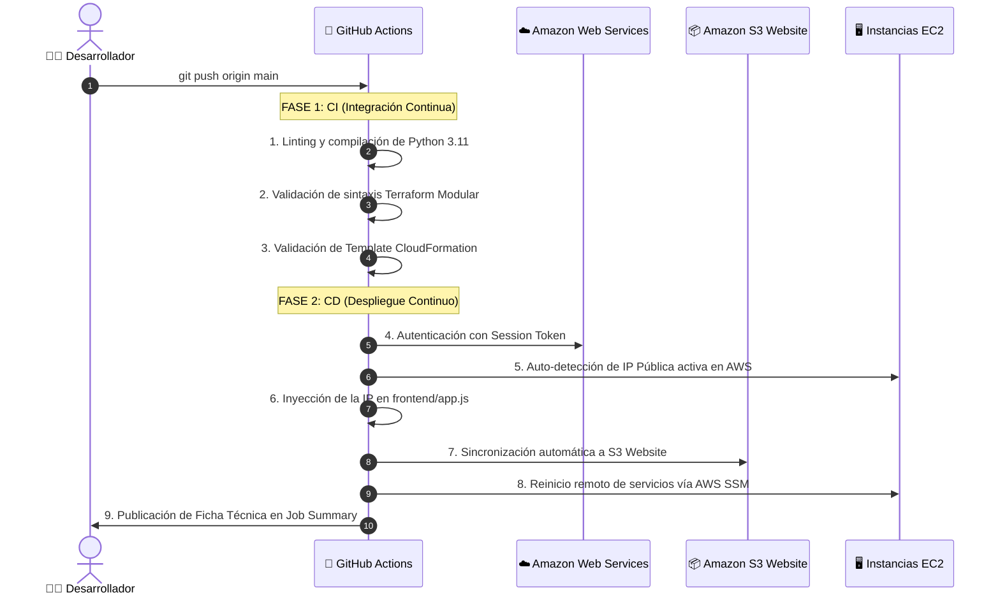

# 📚 GUÍA DE ESTUDIO Y MATERIAL DOCENTE • CLOUD NATIVE ENTERPRISE
## Arquitectura 3-Tier, Persistencia Serverless, IaC y CI/CD en AWS (Duoc UC)

---

### 🎯 Objetivo Pedagógico
Esta guía de estudio está diseñada para **enseñar, exponer y defender** una arquitectura empresarial de nube nativa en Amazon Web Services (AWS). Cubre desde los fundamentos de redes privadas (VPC) hasta la automatización de infraestructura como código (IaC), bases de datos NoSQL serverless (DynamoDB), seguridad Zero-Trust con AWS SSM y pipelines de integración y despliegue continuo (CI/CD) con GitHub Actions.

---



---

## 📑 Índice de Módulos de Aprendizaje

1. [MÓDULO 1: Redes y Arquitectura de 3 Capas (VPC 3-Tier)](#módulo-1-redes-y-arquitectura-de-3-capas-vpc-3-tier)
2. [MÓDULO 2: Cómputo y Optimización de Rendimiento Linux (EC2)](#módulo-2-cómputo-y-optimización-de-rendimiento-linux-ec2)
3. [MÓDULO 3: Persistencia Serverless y Almacenamiento (DynamoDB & S3)](#módulo-3-persistencia-serverless-y-almacenamiento-dynamodb--s3)
4. [MÓDULO 4: Seguridad Zero-Trust y Gestión Sin SSH (AWS SSM)](#módulo-4-seguridad-zero-trust-y-gestión-sin-ssh-aws-ssm)
5. [MÓDULO 5: Infraestructura como Código (CloudFormation vs Terraform)](#módulo-5-infraestructura-como-código-cloudformation-vs-terraform)
6. [MÓDULO 6: DevOps y Pipelines CI/CD con GitHub Actions](#módulo-6-devops-y-pipelines-cicd-con-github-actions)
7. [MÓDULO 7: Banco de Preguntas de Examen y Respuestas Modelo](#módulo-7-banco-de-preguntas-de-examen-y-respuestas-modelo)

---

## MÓDULO 1: Redes y Arquitectura de 3 Capas (VPC 3-Tier)

### 1.1 ¿Por qué una arquitectura de 3 capas en la nube?
En el diseño de software moderno, **nunca se debe exponer la capa de lógica de negocio (Backend) ni la base de datos a internet**. Una arquitectura de 3 capas separa responsabilidades:
* **Capa 1 (Presentación / Perímetro):** Alojada en **Amazon S3 Website** (estática, altamente disponible, costo mínimo) y la **Subred Pública** (10.0.1.0/24) donde reside la máquina expuesta al exterior.
* **Capa 2 (Lógica de Aplicación):** Alojada en la **Subred Privada** (10.0.2.0/24). La API Flask no tiene IP pública, lo que hace **imposible que un atacante externo la ataque directamente desde internet**.
* **Capa 3 (Datos y Persistencia):** Gestionada por **Amazon DynamoDB** mediante endpoints gestionados por AWS y protegidos por políticas IAM.

### 1.2 La solución del NAT Router vs NAT Gateway
* **El problema:** Las máquinas en subredes privadas necesitan salida a internet (para instalar paquetes de Python, comunicarse con DynamoDB y sincronizar librerías), pero no pueden recibir conexiones entrantes no autorizadas.
* **Solución tradicional AWS:** *AWS NAT Gateway* gestionado (Costo: ~$32 USD al mes, inviable en cuentas de estudiante con límite de $50 USD).
* **Solución de Ingeniería Cloud Native:** Convertir la instancia pública en un **NAT Router Linux** mediante el kernel:
  ```bash
  # 1. Habilitar reenvío de paquetes en el Kernel de Linux
  sysctl -w net.ipv4.ip_forward=1

  # 2. Enmascarar paquetes de la subred privada hacia Internet (SNAT / MASQUERADE)
  iptables -t nat -A POSTROUTING -o eth0 -s 10.0.2.0/24 -j MASQUERADE

  # 3. Reenviar peticiones del puerto 8081 hacia la IP interna del Backend (DNAT / Port Forwarding)
  iptables -t nat -A PREROUTING -p tcp --dport 8081 -j DNAT --to-destination 10.0.2.5:8081
  ```

---

## MÓDULO 2: Cómputo y Optimización de Rendimiento Linux (EC2)

### 2.1 El desafío de ejecutar servidores pesados en instancias micro
Un servidor de Minecraft Purpur 1.21.4 con máquina virtual Java (JVM) requiere típicamente 2 a 4 GB de RAM. Sin embargo, en el laboratorio académico se utilizan instancias `t2.micro` / `t3.micro` de **1 GB de memoria RAM física**.

### 2.2 Técnicas de Optimización Aplicadas:
1. **Memoria Virtual Swap con afinidad baja (`swappiness=10`):**
   - Se crea un archivo de paginación de 2 GB en disco NVMe/EBS (`/swapfile`).
   - El parámetro `vm.swappiness=10` obliga al kernel de Linux a priorizar la memoria RAM física para los hilos críticos del juego, usando el disco únicamente cuando es estrictamente necesario.
2. **Recolector de Basura Java G1GC de Baja Pausa:**
   ```bash
   java -Xms512M -Xmx850M -XX:+UseG1GC -XX:MaxGCPauseMillis=50 -jar purpur.jar --nogui
   ```
   - `-Xms512M`: Asignación inicial de 512 MB.
   - `-Xmx850M`: Límite máximo estricto para evitar que el proceso exceda la memoria y el sistema operativo active el *OOM Killer (Out Of Memory Killer)*.
3. **Protocolo RCON con Socket Nativo en Python:**
   - La librería tradicional `mcrcon` usa señales POSIX (`signal.SIGINT`), las cuales fallan en hilos secundarios de Flask/Gunicorn (`ValueError: signal only works in main thread`).
   - **Solución implementada:** Comunicación mediante paquetes TCP binarios nativos (estructura *little-endian* con encabezados de longitud, ID de petición y tipo de paquete), permitiendo ejecución simultánea sin interferir con el ciclo de vida del servidor web.

---

## MÓDULO 3: Persistencia Serverless y Almacenamiento (DynamoDB & S3)

### 3.1 Amazon DynamoDB (Base de Datos NoSQL)
* **Modelo:** Clave-Valor / Documento JSON.
* **Clave Primaria (Partition Key):** `email` (String) — Garantiza unicidad por cada alumno o jugador registrado.
* **Modo de Facturación:** `PAY_PER_REQUEST` (Bajo demanda) — Cero costo mientras no existan lecturas/escrituras activas.
* **Operaciones SDK (Boto3):**
  - `table.put_item(Item={...})`: Registro atómico de jugador.
  - `table.get_item(Key={'email': ...})`: Consulta directa en tiempo O(1).
  - `table.delete_item(Key={'email': ...})`: Eliminación instantánea.
  - `table.scan()`: Listado completo para alimentar el panel web.

### 3.2 Amazon S3 (Estrategia Dual de Almacenamiento)
* **Bucket 1: Frontend Website Hosting:**
  - Aloja los archivos estáticos (`index.html`, `styles.css`, `app.js`).
  - Configurado con política de lectura pública (`s3:GetObject`) y bloqueo de acceso público desactivado para servir contenido a navegadores.
* **Bucket 2: Respaldos con Versionamiento (Disaster Recovery):**
  - Versionamiento habilitado (`VersioningConfiguration: Status=Enabled`).
  - Si un archivo de respaldo se sobrescribe o elimina por error, AWS conserva las versiones históricas anteriores para recuperación ante desastres.

---

## MÓDULO 4: Seguridad Zero-Trust y Gestión Sin SSH (AWS SSM)

### 4.1 ¿Por qué eliminar el puerto 22 (SSH)?
1. Abrir el puerto 22 a `0.0.0.0/0` expone los servidores a ataques automatizados de fuerza bruta y escaneo de puertos.
2. La gestión de llaves privadas (`.pem` / `.id_rsa`) representa un riesgo de fuga de credenciales si los alumnos suben las claves por error a repositorios públicos de GitHub.

### 4.2 Solución: AWS Systems Manager (SSM)
* Las instancias EC2 tienen asignado el rol `LabInstanceProfile`.
* El agente `amazon-ssm-agent` se comunica mediante conexiones salientes cifradas por HTTPS hacia el plano de control de AWS.
* **Beneficios:**
  - Terminal interactiva directa con `aws ssm start-session --target <id_instancia>`.
  - Ejecución remota de scripts sin tocar la máquina con `aws ssm send-command`.
  - Registro de auditoría centralizado en AWS CloudTrail.

---

## MÓDULO 5: Infraestructura como Código (CloudFormation vs Terraform)

El proyecto cuenta con **doble soporte IaC** validado para comparar ambas herramientas líderes de la industria:

| Característica | AWS CloudFormation (`cloudformation/`) | HashiCorp Terraform (`terraform/`) |
|---|---|---|
| **Formato** | YAML nativo de AWS | HCL (HashiCorp Configuration Language) |
| **Estructura** | Archivo monolítico de 700 líneas con parámetros | Modular (4 módulos: `networking`, `storage`, `security`, `compute`) |
| **Estado (State)** | Gestionado automáticamente en AWS | Archivo `terraform.tfstate` |
| **Despliegue** | 1 comando con `aws cloudformation deploy` | `terraform init` ➔ `terraform plan` ➔ `terraform apply` |
| **Auditoría de Cambios** | CloudFormation ChangeSets | `terraform plan` con resumen de recursos a crear/destruir |

---

## MÓDULO 6: DevOps y Pipelines CI/CD con GitHub Actions

### 6.1 Anatomía del Pipeline de 2 Fases (`.github/workflows/ci-cd-pipeline.yml`)



### 6.2 FinOps y Cuidado del Presupuesto ($50 USD)
* Para evitar consumir créditos de AWS Academy fuera de horario, se diseñaron dos mecanismos de limpieza en 1 solo paso:
  1. **Local:** `scripts/clean-all-aws.ps1` (vacía buckets S3 y elimina el stack en 2 minutos).
  2. **En la Nube:** Workflow de GitHub Actions **`🧹 Clean & Destroy Infrastructure`** con confirmación interactiva.

---

## MÓDULO 7: Banco de Preguntas de Examen y Respuestas Modelo

### ❓ Pregunta 1: ¿Por qué la API Flask se encuentra en una subred privada y cómo se comunica con los usuarios?
> **Respuesta Modelo:**  
> *"La API Flask reside en la subred privada (10.0.2.0/24) siguiendo el principio de defensa en profundidad y aislamiento de capas. No posee una IP pública, evitando ataques directos de internet. Las solicitudes HTTP llegan a la instancia NAT perimetral en el puerto 8081, donde una regla de firewall de Linux (`iptables PREROUTING -j DNAT`) reenvía el tráfico de forma transparente hacia la IP privada `10.0.2.5:8081`. La respuesta retorna al cliente enmascarada por la regla `POSTROUTING -j MASQUERADE`."*

### ❓ Pregunta 2: ¿Cómo se resolvió el problema de sincronización de la Whitelist de Minecraft con DynamoDB?
> **Respuesta Modelo:**  
> *"Se implementó un patrón transaccional en el Backend: cuando el cliente envía un `POST /api/usuarios`, la API primero inserta el documento en Amazon DynamoDB mediante el SDK `boto3`. Si la inserción es exitosa, se abre un socket TCP binario directo al puerto 25575 (RCON) de la instancia de Minecraft para ejecutar en caliente el comando `whitelist add <gamertag>`. Si el jugador se elimina (`DELETE /api/usuarios/<email>`), se borra de DynamoDB y se remueve de la lista blanca con `whitelist remove <gamertag>`."*

### ❓ Pregunta 3: ¿Por qué no fue necesario crear llaves SSH (`.pem`) para administrar los servidores?
> **Respuesta Modelo:**  
> *"Porque se adoptó el estándar de seguridad Zero-Trust mediante **AWS Systems Manager (SSM)**. Las instancias ejecutan el agente de SSM con el rol IAM `LabInstanceProfile`. Las conexiones de administración y ejecución de comandos remotos se realizan mediante túneles seguros TLS gestionados por el plano de control de AWS, eliminando por completo la necesidad de abrir el puerto 22 en los Security Groups o gestionar claves criptográficas en los equipos de los alumnos."*

### ❓ Pregunta 4: ¿Qué ventaja tiene usar Amazon S3 para el Frontend en lugar de servirlo desde la misma máquina EC2?
> **Respuesta Modelo:**  
> *"Servir el Frontend desde Amazon S3 Website Hosting desacopla totalmente la capa de presentación de la capa de cómputo. S3 ofrece una disponibilidad del 99.99%, escalabilidad infinita y costo casi nulo para activos estáticos (HTML/CSS/JS), liberando la memoria RAM y CPU de la instancia EC2 para que se dedique exclusivamente al procesamiento del servidor de juegos y la API."*

### ❓ Pregunta 5: ¿Cómo maneja el pipeline de CI/CD los cambios de IP cuando el laboratorio de AWS Academy se reinicia?
> **Respuesta Modelo:**  
> *"Dado que las instancias EC2 sin IP elástica fija cambian de dirección IP pública tras cada ciclo de reinicio en AWS Academy, el job de Despliegue Continuo (CD) en GitHub Actions ejecuta un paso previo con el AWS CLI que consulta dinámicamente la IP pública de la instancia NAT mediante filtros de etiquetas (`Name=ec2-lab-cloud-native-duoc-nat-minecraft`). El pipeline sustituye esa IP en `frontend/app.js` usando `sed` antes de sincronizar el bucket S3, garantizando que el panel web siempre apunte al servidor correcto sin intervención humana."*

---

### 🏆 Resumen Ejecutivo para la Presentación
* **Institución:** Duoc UC
* **Asignatura:** Arquitectura Cloud Native
* **Plataforma:** Amazon Web Services (AWS Academy Learner Lab)
* **Patrón de Arquitectura:** 3-Tier Híbrido (IaaS Compute + Serverless Data/Frontend + DevOps CI/CD)
* **Repositorio del Proyecto:** [https://github.com/jhonabruzzi278/Minecraft-aws](https://github.com/jhonabruzzi278/Minecraft-aws)
