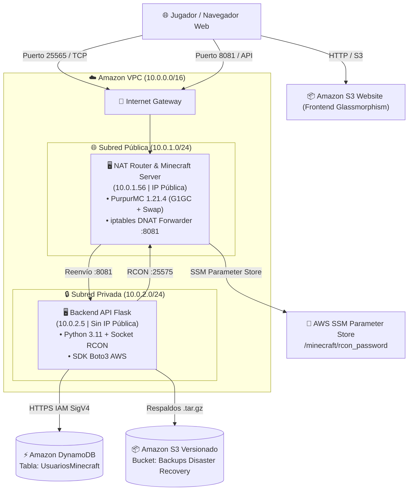

# 🎮 Suite Cloud Native Enterprise • Servidor Minecraft en AWS
## Arquitectura 3-Tier, Persistencia Serverless (DynamoDB/S3), IaC y CI/CD en AWS

**Institución:** Duoc UC • Escuela de Informática y Telecomunicaciones  
**Asignatura:** Arquitectura Cloud Native  
**Autor:** Jonathan Guerra  
**Región AWS:** `us-east-1` (N. Virginia)  
**Presupuesto Lab:** $50 USD (AWS Academy Learner Lab)  
**Panel Web en Producción (Amazon S3):** [http://cf-duoc-cloud-native-frontendwebsitebucket-t1v4j7neddlu.s3-website-us-east-1.amazonaws.com](http://cf-duoc-cloud-native-frontendwebsitebucket-t1v4j7neddlu.s3-website-us-east-1.amazonaws.com)  
**Dirección IP de Minecraft:** `3.231.202.80:25565`

---

## 📚 Material Docente y Enlaces de Estudio

* 📄 **[GUIA_ESTUDIO_CLOUD_NATIVE_AWS.md](GUIA_ESTUDIO_CLOUD_NATIVE_AWS.md)** ➔ **Guía Maestra de Estudio:** Explicación técnica paso a paso de los 7 módulos de aprendizaje y banco de preguntas de examen con respuestas modelo.
* 📑 **[DOCUMENTACION_PROYECTO_AWS_MINECRAFT.md](DOCUMENTACION_PROYECTO_AWS_MINECRAFT.md)** ➔ **Bitácora de Arquitectura y Troubleshooting:** Runbooks operativos, resolución de bugs de red (`getsockopt`), tuning de JVM y gestión Zero-Trust con AWS SSM.
* 🎨 **[diagrams/index.html](diagrams/index.html)** ➔ **Galería Interactiva de Diagramas:** 5 diagramas visuales en alta resolución para presentaciones y defensas técnicas.

---

## 🏛️ Topología de Arquitectura Cloud Native



---

## 📁 Estructura del Repositorio

```text
├── README.md                                  # 📖 Manual principal del proyecto
├── GUIA_ESTUDIO_CLOUD_NATIVE_AWS.md           # 🎓 Guía de estudio y material docente
├── DOCUMENTACION_PROYECTO_AWS_MINECRAFT.md    # 📑 Bitácora técnica y runbooks
│
├── frontend/                                  # 🌐 Frontend Web Dashboard
│   ├── index.html                             # Panel Glassmorphism con Avatares 3D
│   ├── app.js                                 # Lógica de cliente, auto-refresh y RCON
│   └── styles.css                             # Estilos oscuros modernos y responsive
│
├── backend/                                   # 🐍 Backend REST API (Python 3.11)
│   ├── app.py                                 # API Flask con DynamoDB y Sockets RCON
│   ├── requirements.txt                       # Dependencias de producción
│   ├── Dockerfile                             # Imagen de contenedor con Gunicorn
│   └── docker-compose.yml                     # Orquestación de contenedores
│
├── cloudformation/                            # 📄 Infraestructura como Código (AWS CFN)
│   └── cd-cloud-native-duoc.yaml              # Stack monolítico todo-en-uno
│
├── terraform/                                 # 🛠️ Infraestructura como Código (Terraform)
│   ├── main.tf                                # Orquestador raíz
│   ├── variables.tf                           # Variables tipadas
│   ├── outputs.tf                             # Salidas de endpoints e IPs
│   └── modules/                               # 🧩 4 Módulos desacoplados
│       ├── networking/                        # VPC, IGW, Subredes y Tablas de Ruteo
│       ├── storage/                           # DynamoDB y Buckets S3 (Web + DR)
│       ├── security/                          # Security Groups y Parameter Store
│       └── compute/                           # EC2 NAT, EC2 Backend y CloudWatch
│
├── diagrams/                                  # 🎨 Galería de Diagramas Editoriales
│   ├── index.html                             # Hub central de diagramas
│   ├── 01_arquitectura_red_aws.html           # Red VPC 3-Tier y Flujo de Paquetes
│   ├── 02_pila_tecnologica_minecraft.html     # Pila Tecnológica de 6 Capas
│   ├── 03_resolucion_bugs_firewall.html       # Troubleshooting Runbook (iptables/G1GC)
│   ├── 04_flujo_iac_despliegue.html           # Comparativa CloudFormation vs Terraform
│   └── 05_arquitectura_cicd_servicios_aws.html# Pipeline DevOps CI/CD y Ecosistema AWS
│
├── scripts/                                   # 🛠️ Scripts de Automatización
│   ├── set-credentials.ps1                    # Actualizador de credenciales AWS Academy
│   ├── audit-aws.ps1                          # Auditoría de recursos activos en AWS
│   ├── clean-all-aws.ps1                      # Limpieza rápida para cuidar el presupuesto
│   └── sync-frontend-s3.ps1                   # Sincronizador de frontend a Amazon S3
│
└── .github/workflows/                         # 🚀 Automatización CI/CD con GitHub Actions
    ├── ci-cd-pipeline.yml                     # Pipeline de 2 fases (CI + CD a AWS)
    └── destroy-infra.yml                      # Destrucción bajo demanda de recursos
```

---

## ⚡ Comandos Rápidos de Gestión

### 1. Actualizar Credenciales de AWS Academy:
```powershell
.\scripts\set-credentials.ps1
```

### 2. Auditar Recursos Activos en AWS:
```powershell
.\scripts\audit-aws.ps1
```

### 3. Limpiar y Destruir Todo para Cuidar los $50 USD:
```powershell
.\scripts\clean-all-aws.ps1
```

---

## 🚀 Despliegue de Infraestructura

### Con AWS CloudFormation:
```powershell
aws cloudformation create-stack `
  --stack-name cf-duoc-cloud-native `
  --template-body file://cloudformation/cd-cloud-native-duoc.yaml `
  --parameters ParameterKey=OwnerName,ParameterValue="Jonathan" `
  --capabilities CAPABILITY_IAM
```

### Con HashiCorp Terraform:
```powershell
cd terraform
terraform init
terraform plan
terraform apply -auto-approve
```

---

### 🏆 Ficha Técnica del Proyecto
* **Patrón de Arquitectura:** 3-Tier Híbrido (IaaS Compute + Serverless Data/Frontend + DevOps CI/CD)
* **Base de Datos:** Amazon DynamoDB (NoSQL, `PAY_PER_REQUEST`, Partition Key: `email`)
* **Frontend:** Amazon S3 Static Website Hosting (HTML5, Vanilla CSS Glassmorphism, JS ES6)
* **Seguridad:** Zero-Trust vía AWS SSM Session Manager (Sin puerto 22 SSH)
* **Automatización:** GitHub Actions CI/CD Pipeline con auto-detección dinámica de IP
